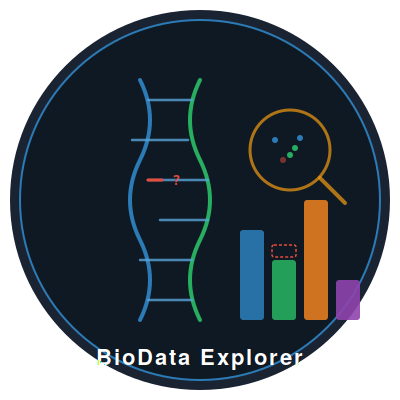

# BioData Explorer 

<!-- badges: start -->
[](https://github.com/yourusername/BioDataExplorer/actions)
[](https://opensource.org/licenses/MIT)
<!-- badges: end -->

**An interactive toolkit for exploring, diagnosing, and understanding biological datasets.**

BioData Explorer helps researchers quickly assess data quality, detect variable types, analyse missing data patterns, and explore variable relationships — all from a single R package with an interactive Shiny dashboard.

## Why?

When you receive a fresh biological dataset, the first questions are always the same:

- **What variables do I have?** (numeric, categorical, ordinal, identifiers?)
- **How much is missing?** (and does it matter for my analysis?)
- **How do variables relate to each other?** (correlations, group differences, associations?)

BioData Explorer answers all of these in seconds.

## Features

| Feature | R Functions | Shiny Tab |
|---------|------------|-----------|
| **Data overview** | `data_overview()` | Overview |
| **Auto-detect variable types** | `detect_variable_types()` | Variable Types |
| **Override types manually** | `override_variable_type()` | Variable Types |
| **Missing value summary** | `missing_summary()` | Missing Data |
| **Missing pattern analysis + MCAR test** | `missing_pattern_analysis()` | Missing Data |
| **"Does missingness matter?" assessment** | Built into `missing_pattern_analysis()` | Missing Data |
| **Imputation suggestions** | `suggest_imputation()` | Missing Data |
| **Variable relationship testing** | `variable_relationship()` | Relationships |
| **Interactive dashboard** | `launch_app()` | All tabs |

## Installation

```r
# Install from GitHub
devtools::install_github("yourusername/BioDataExplorer")
```

## Quick Start

### Use the Shiny App

```r
library(BioDataExplorer)
launch_app()
```

This opens the interactive dashboard where you can upload your data and explore everything visually.

### Use the R Functions

```r
library(BioDataExplorer)

# Load your data
df <- read.csv("my_clinical_data.csv")

# 1. Get a full overview
overview <- data_overview(df)
print(overview)

# 2. Check variable types
types <- detect_variable_types(df)
types

# 3. Analyse missing data
miss <- missing_pattern_analysis(df)
print(miss)  # Includes MCAR test + "does it matter?" assessment

# 4. Get imputation suggestions
suggest_imputation(df)

# 5. Explore relationships between specific variables
rel <- variable_relationship(df, "age", "treatment_group")
print(rel$interpretation)
print(rel$plot)
```

## Built-in Demo Datasets

The Shiny app includes three demo datasets you can explore immediately:

- **Iris** — Classic general-purpose dataset
- **Clinical trial** — Simulated patient metadata with realistic missingness patterns (including MNAR)
- **Microbiome** — Simulated 16S-style count data with sample metadata

## Variable Types Detected

| Type | Description | Example |
|------|-------------|---------|
| `numeric_continuous` | Continuous measurements | BMI, biomarker levels |
| `numeric_discrete` | Integer-like with few unique values | Number of symptoms, Likert scores |
| `categorical_nominal` | Unordered categories | Treatment group, sample site |
| `categorical_ordinal` | Ordered categories | Disease stage, severity |
| `binary` | Two-level variables | Yes/No, Male/Female, 0/1 |
| `date_time` | Date or datetime | Collection date |
| `identifier` | High-cardinality IDs | Patient ID, sample ID |
| `free_text` | Long-form text | Clinical notes |

## Missing Data Analysis

The missing data module provides:

1. **Per-variable summary** — count, percentage, severity classification
2. **Pattern visualisation** — heatmap, upset plot, co-missingness matrix
3. **Little's MCAR test** — formal statistical test for randomness of missingness
4. **Impact assessment** — for each variable, determines whether missingness is likely to bias your analysis and why
5. **Imputation suggestions** — recommends strategies based on variable type and missingness severity

## Relationship Analysis

Select any two variables and the app automatically:

- Detects their types
- Chooses the right statistical test (correlation, t-test, ANOVA, chi-squared)
- Calculates effect sizes (Pearson r, Cohen's d, eta-squared, Cramér's V)
- Generates an appropriate plot
- Provides a plain-English interpretation

## Contributing

Contributions welcome! Please open an issue or submit a pull request.

## License

MIT
